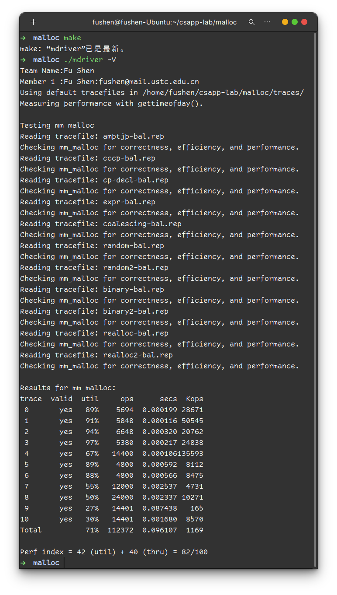

<h1><center>计算机系统详解实验报告</center></h1>

<center>傅申 PB20000051</center>

[TOC]

# Data Lab

## 整形部分

### `bitXor()`

异或操作等价于 $x\oplus y = (x\cdot \lnot y)+ (\lnot x \cdot y) = \lnot (\lnot(x\cdot \lnot y)\cdot \lnot(\lnot x \cdot y))$, 所以

```c
/* 
 * bitXor - x^y using only ~ and & 
 *   Example: bitXor(4, 5) = 1
 *   Legal ops: ~ &
 *   Max ops: 14
 *   Rating: 1
 */
int bitXor(int x, int y) {
  return ~(~(x & ~y) & ~(~x & y));
}
```

### `tmin()`

最小的补码表示的整形为 $-2^{31}$, 即 `0x80000000`, 所以

```c
/* 
 * tmin - return minimum two's complement integer 
 *   Legal ops: ! ~ & ^ | + << >>
 *   Max ops: 4
 *   Rating: 1
 */
int tmin(void) {
  return 1 << 31;
}
```

### `isTmax()`

最大的补码表示的整形为 $2^{31}-1$, 即 `0x7FFFFFFF`, 若 `x` 为 `0x7FFFFFFF`, 则 `2x + 1` 为 `0xFFFFFFFF`, 再加 1 后就变为 0, 满足这一式子的数只有 `0x7FFFFFFF` 和 `0xFFFFFFFF`, 后者加 1 后变为 0, 可以以此区分. 如下

```c
/*
 * isTmax - returns 1 if x is the maximum, two's complement number,
 *     and 0 otherwise 
 *   Legal ops: ! ~ & ^ | +
 *   Max ops: 10
 *   Rating: 1
 */
int isTmax(int x) {
  int y = x + 1;
  x = x + y;
  x = ~x;
  y = !y;
  x = x + y;
  return !x;
}
```

### `allOddBits()`

利用掩码 `0xAAAAAAAA` 与 `x` 相与去掉偶数位, 再与 `0xAAAAAAAA` 异或, 若 `x` 的所有奇数位为 1, 则结果为 0, 否则非零, 利用逻辑非操作即可得到结果. 如下

```c
/* 
 * allOddBits - return 1 if all odd-numbered bits in word set to 1
 *   where bits are numbered from 0 (least significant) to 31 (most significant)
 *   Examples allOddBits(0xFFFFFFFD) = 0, allOddBits(0xAAAAAAAA) = 1
 *   Legal ops: ! ~ & ^ | + << >>
 *   Max ops: 12
 *   Rating: 2
 */
int allOddBits(int x) {
  int mask = 0xAA + (0xAA << 8);
  mask = mask + (mask << 16);
  return !((x & mask) ^ mask);
}
```

### `negate()`

按位取反再加 1 即可得到相反数, 如下

```c
/* 
 * negate - return -x 
 *   Example: negate(1) = -1.
 *   Legal ops: ! ~ & ^ | + << >>
 *   Max ops: 5
 *   Rating: 2
 */
int negate(int x) {
  return ~x + 1;
}
```

### `isAsciiDigit()`

若 `x` < `0x30`, 则 `x - 0x30` 是负数, 最高位为 1, 与 `0x80000000` 按位与后非零, 再逻辑非后为 0. 同理, 若 `x` > `0x39`, 则 `0x39 - x` 是负数. 如下

```c
/* 
 * isAsciiDigit - return 1 if 0x30 <= x <= 0x39 (ASCII codes for characters '0' to '9')
 *   Example: isAsciiDigit(0x35) = 1.
 *            isAsciiDigit(0x3a) = 0.
 *            isAsciiDigit(0x05) = 0.
 *   Legal ops: ! ~ & ^ | + << >>
 *   Max ops: 15
 *   Rating: 3
 */
int isAsciiDigit(int x) {
  int MSB = 1 << 31;
  return !((x + ~0x30 + 1) & MSB) & !((0x39 + ~x + 1) & MSB);
}
```

### `conditional()`

为实现三目运算符, 需要设置一个掩码 `mask`, 它在 x 为 0 时等于 `0x00000000`, 非零时等于 `0xFFFFFFFF`. 最后返回 `mask & y` 和 `~mask & z` 按位或的结果即可. 掩码通过两层逻辑非加上按位取反加一即可得到, 如下

```c
/* 
 * conditional - same as x ? y : z 
 *   Example: conditional(2,4,5) = 4
 *   Legal ops: ! ~ & ^ | + << >>
 *   Max ops: 16
 *   Rating: 3
 */
int conditional(int x, int y, int z) {
  int mask = ~(!!x) + 1;
  return (mask & y) | (~mask & z);
}
```

### `isLessOrEqual()`

若 `x <= y`, 有下面两种情况

- `x < 0`, `y >= 0`: 这时看`x`, `y` 符号位就能得到结果
- `x`, `y` 符号相同: 这时需要看 `y - x` 的符号位

代码如下

```c
/* 
 * isLessOrEqual - if x <= y  then return 1, else return 0 
 *   Example: isLessOrEqual(4,5) = 1.
 *   Legal ops: ! ~ & ^ | + << >>
 *   Max ops: 24
 *   Rating: 3
 */
int isLessOrEqual(int x, int y) {
  int x_sign = x >> 31;
  int y_sign = y >> 31;
  int sub = y + ~x + 1;
  return (x_sign & !y_sign) | (!(x_sign ^ y_sign) & !(sub >> 31));
}
```

### `logicalNeg()`

若 `x` 非零, 则 `x` 和 `-x` 中有一个符号位为 1, 否则均为 0. 将两数按位或后右移 31 位, 若 `x` 非零则为 `0xFFFFFFFF`, 否则为 `0x00000000`, 按位取反后再与 `0x00000001` 按位与即可得到结果. 如下

```c
/* 
 * logicalNeg - implement the ! operator, using all of 
 *              the legal operators except !
 *   Examples: logicalNeg(3) = 0, logicalNeg(0) = 1
 *   Legal ops: ~ & ^ | + << >>
 *   Max ops: 12
 *   Rating: 4 
 */
int logicalNeg(int x) {
  return ~((x | (~x + 1)) >> 31) & 1;
}
```

### `howManyBits()`

- 首先, 若 `x` 为负数, 需要对其取反, 这一点可以通过 `x` 与 `x >> 31` 异或得到.
- 其次, 若 `x` 需要 m 位来表示, 则 `!!(x >> m)` 就是 1.
- 可以采取二分的思想, 依次判断 `x` 是否需要 16, 8, 4, 2, 1 位, 需要就右移对应位数继续判断, 最后加起来

如下

```c
int howManyBits(int x) {
  x = x ^ (x >> 31);
  int b16, b8, b4, b2, b1;
  b16 = !!(x >> 16) << 4;
  x = x >> b16;
  b8 = !!(x >> 8) << 3;
  x = x >> b8;
  b4 = !!(x >> 4) << 2;
  x = x >> b4;
  b2 = !!(x >> 2) << 1;
  x = x >> b2;
  b1 = !!(x >> 1);
  x = x >> b1;
  return b16 + b8 + b4 + b2 + b1 + x + 1;
}
```

## 浮点部分

单精度浮点数有三部分

- 符号位 s (bit 31)
- 指数 e (bit 30 - 23)
- 尾数 f (bit 22 - 0)

### `floatScale2()`

- 若 `uf` 的指数为 0, 则 `uf` 是 0 或非规约形式浮点数, 此时只需要将 `uf` 左移一位然后加上符号位即可.
- 若 `uf` 的指数为 `0xFF`, 则 `uf` 是正负无穷或 `NaN`, 只需要返回 `uf` 本身.
- 若 `uf` 的指数为 `0xFE`, 则 `uf * 2` 超出了表示范围, 返回正负无穷.
- 其他情况只需要将 `uf` 的指数加 1

```c
/* 
 * floatScale2 - Return bit-level equivalent of expression 2*f for
 *   floating point argument f.
 *   Both the argument and result are passed as unsigned int's, but
 *   they are to be interpreted as the bit-level representation of
 *   single-precision floating point values.
 *   When argument is NaN, return argument
 *   Legal ops: Any integer/unsigned operations incl. ||, &&. also if, while
 *   Max ops: 30
 *   Rating: 4
 */
unsigned floatScale2(unsigned uf) {
  int s = uf & 0x80000000;
  int e = (uf >> 23) & 0xFF;
  if (e == 0) return (uf << 1) | s; // 0 & denormalized
  if (e == 0xFF) return uf; // inf or NaN
  e = e + 1;
  if (e == 0xFF) return 0x7F800000 | s;
  return (e << 23) | (uf & 0x807FFFFF);
}
```

### `floatFloat2Int()`

首先检查指数 `e` 减去 127 后的值:

- 若小于 0, 则 `uf` 过小, 直接返回 0
- 若大于 0, 则超出范围 (或为无穷/`NaN`), 返回 `0x80000000`

- 其他情况下, 先取出尾数 `f` 再加上 `0x800000` 共 24 位 (即 `1.f << 23`), 若 `e - 127 > 23` 则需要左移, 否则右移. 最后按符号返回.

如下

```c
int floatFloat2Int(unsigned uf) {
  int s = uf >> 31;
  int e = ((uf >> 23) & 0xFF) - 127;
  int f = (uf & 0x7FFFFF) | 0x800000;

  if (e < 0) return 0;
  if (e > 31) return 0x80000000;

  if (e > 23) f = f << (e - 23);
  else f = f >> (23 - e);

  return s ? -f : f;
}
```

### `floatPower2()`

因为要返回 $2.0^x = (-1)^0 \times 2^{(x + 127) - 127}\times 1.00\cdots0$, 所以符号位 `s` 为 0, 指数 `e` 为 `x + 127`, 尾数 `f` 为 0. 按 `e` 的大小分情况讨论:

- 若 `e < 0`, 则结果太小, 直接返回 0 即可.
- 若 `e >= 0xFF`, 则结果太大, 返回正无穷.
- 其他情况直接返回 `e << 23` 即可.

如下

```c
/* 
 * floatPower2 - Return bit-level equivalent of the expression 2.0^x
 *   (2.0 raised to the power x) for any 32-bit integer x.
 *
 *   The unsigned value that is returned should have the identical bit
 *   representation as the single-precision floating-point number 2.0^x.
 *   If the result is too small to be represented as a denorm, return
 *   0. If too large, return +INF.
 * 
 *   Legal ops: Any integer/unsigned operations incl. ||, &&. Also if, while 
 *   Max ops: 30 
 *   Rating: 4
 */
unsigned floatPower2(int x) {
  int e = x + 127;
  if (e < 0) return 0;
  if (e >= 0xFF) return 0x7F800000;
  return (e << 23);
}
```

## 测试结果

实验的测试结果截图如下, 可以看到拿到了全部的 36 分.


# Bomb Lab

使用 gdb 来读取汇编代码, `disas` 指令能反汇编函数.

## Phase 1

Phase 1 的汇编为

```plantext
(gdb) disas phase_1
Dump of assembler code for function phase_1:
   0x0000000000400ee0 <+0>:     sub    $0x8,%rsp
   0x0000000000400ee4 <+4>:     mov    $0x402400,%esi
   0x0000000000400ee9 <+9>:     call   0x401338 <strings_not_equal>
   0x0000000000400eee <+14>:    test   %eax,%eax
   0x0000000000400ef0 <+16>:    je     0x400ef7 <phase_1+23>
   0x0000000000400ef2 <+18>:    call   0x40143a <explode_bomb>
   0x0000000000400ef7 <+23>:    add    $0x8,%rsp
   0x0000000000400efb <+27>:    ret    
End of assembler dump.
```

可以看出, 函数调用了 `strings_not_equal` 函数判断两个字符串是否相等. 输入的字符串将与 `0x402400` 中的字符串进行比较, 因此 `0x402400` 中的字符串就是要输入的字符串, 该字符串为

```plaintext
(gdb) p (char *)0x402400
$1 = 0x402400 "Border relations with Canada have never been better."
```

即要输入

```plaintext
Border relations with Canada have never been better.
```

## Phase 2

Phase 2 的汇编为

```plaintext
(gdb) disas phase_2
Dump of assembler code for function phase_2:
   0x0000000000400efc <+0>:     push   %rbp
   0x0000000000400efd <+1>:     push   %rbx
   0x0000000000400efe <+2>:     sub    $0x28,%rsp
   0x0000000000400f02 <+6>:     mov    %rsp,%rsi
   0x0000000000400f05 <+9>:     call   0x40145c <read_six_numbers>
   0x0000000000400f0a <+14>:    cmpl   $0x1,(%rsp)
   0x0000000000400f0e <+18>:    je     0x400f30 <phase_2+52>
   0x0000000000400f10 <+20>:    call   0x40143a <explode_bomb>
   0x0000000000400f15 <+25>:    jmp    0x400f30 <phase_2+52>
   0x0000000000400f17 <+27>:    mov    -0x4(%rbx),%eax
   0x0000000000400f1a <+30>:    add    %eax,%eax
   0x0000000000400f1c <+32>:    cmp    %eax,(%rbx)
   0x0000000000400f1e <+34>:    je     0x400f25 <phase_2+41>
   0x0000000000400f20 <+36>:    call   0x40143a <explode_bomb>
   0x0000000000400f25 <+41>:    add    $0x4,%rbx
   0x0000000000400f29 <+45>:    cmp    %rbp,%rbx
   0x0000000000400f2c <+48>:    jne    0x400f17 <phase_2+27>
   0x0000000000400f2e <+50>:    jmp    0x400f3c <phase_2+64>
   0x0000000000400f30 <+52>:    lea    0x4(%rsp),%rbx
   0x0000000000400f35 <+57>:    lea    0x18(%rsp),%rbp
   0x0000000000400f3a <+62>:    jmp    0x400f17 <phase_2+27>
   0x0000000000400f3c <+64>:    add    $0x28,%rsp
   0x0000000000400f40 <+68>:    pop    %rbx
   0x0000000000400f41 <+69>:    pop    %rbp
   0x0000000000400f42 <+70>:    ret    
End of assembler dump.
```

可以看到, 函数调用了 `read_six_numbers` 函数, 所以需要输入六个数字. 根据 `0x400f0a` 中的指令 `cmpl $0x1, (%rsp)` 和下一条 `je 0x400f30 <phase_2+52>` 可知第一个数必须为 1. 而后面的指令在判断后一个数是否是前一个数的两倍, 所以需要输入首项为 1, 公比为 2 的等比数列的前 6 项, 即

```plaintext
1 2 4 8 16 32
```

## Phase 3

Phase 3 的汇编为

```plaintext
(gdb) disas phase_3
Dump of assembler code for function phase_3:
   0x0000000000400f43 <+0>:     sub    $0x18,%rsp
   0x0000000000400f47 <+4>:     lea    0xc(%rsp),%rcx
   0x0000000000400f4c <+9>:     lea    0x8(%rsp),%rdx
   0x0000000000400f51 <+14>:    mov    $0x4025cf,%esi
   0x0000000000400f56 <+19>:    mov    $0x0,%eax
   0x0000000000400f5b <+24>:    call   0x400bf0 <__isoc99_sscanf@plt>
   0x0000000000400f60 <+29>:    cmp    $0x1,%eax
   0x0000000000400f63 <+32>:    jg     0x400f6a <phase_3+39>
   0x0000000000400f65 <+34>:    call   0x40143a <explode_bomb>
   0x0000000000400f6a <+39>:    cmpl   $0x7,0x8(%rsp)
   0x0000000000400f6f <+44>:    ja     0x400fad <phase_3+106>
   0x0000000000400f71 <+46>:    mov    0x8(%rsp),%eax
   0x0000000000400f75 <+50>:    jmp    *0x402470(,%rax,8)
   0x0000000000400f7c <+57>:    mov    $0xcf,%eax
   0x0000000000400f81 <+62>:    jmp    0x400fbe <phase_3+123>
   0x0000000000400f83 <+64>:    mov    $0x2c3,%eax
   0x0000000000400f88 <+69>:    jmp    0x400fbe <phase_3+123>
   0x0000000000400f8a <+71>:    mov    $0x100,%eax
   0x0000000000400f8f <+76>:    jmp    0x400fbe <phase_3+123>
   0x0000000000400f91 <+78>:    mov    $0x185,%eax
   0x0000000000400f96 <+83>:    jmp    0x400fbe <phase_3+123>
   0x0000000000400f98 <+85>:    mov    $0xce,%eax
   0x0000000000400f9d <+90>:    jmp    0x400fbe <phase_3+123>
   0x0000000000400f9f <+92>:    mov    $0x2aa,%eax
   0x0000000000400fa4 <+97>:    jmp    0x400fbe <phase_3+123>
   0x0000000000400fa6 <+99>:    mov    $0x147,%eax
   0x0000000000400fab <+104>:   jmp    0x400fbe <phase_3+123>
   0x0000000000400fad <+106>:   call   0x40143a <explode_bomb>
   0x0000000000400fb2 <+111>:   mov    $0x0,%eax
   0x0000000000400fb7 <+116>:   jmp    0x400fbe <phase_3+123>
   0x0000000000400fb9 <+118>:   mov    $0x137,%eax
   0x0000000000400fbe <+123>:   cmp    0xc(%rsp),%eax
   0x0000000000400fc2 <+127>:   je     0x400fc9 <phase_3+134>
   0x0000000000400fc4 <+129>:   call   0x40143a <explode_bomb>
   0x0000000000400fc9 <+134>:   add    $0x18,%rsp
   0x0000000000400fcd <+138>:   ret    
End of assembler dump.
```

首先, 函数调用了 `sscanf` 函数, 其格式字符串地址在 `%esi` 中, 即 `0x4025cf`, 为

```plaintext
(gdb) p (char *)0x4025cf
$2 = 0x4025cf "%d %d"
```

所以需要输入两个数字, 根据 `0x400f6a` 中的 `cmpl $0x7, 0x8(%rsp)` 和下一条 `ja 0x400fad <phase_3+106>` 可知第一个数字要小于等于 7. 而 `0x400f75` 中的 `jmp *0x402470(,%rax,8)` 跳转指令给出了第二个数与第一个数之间的关系, 观察下面的指令可以得出

| 第一个数 | 第二个数的十六进制 | 第二个数的十进制 |
| :------: | :----------------: | :--------------: |
|    0     |       `0xcf`       |       207        |
|    1     |      `0x137`       |       311        |
|    2     |      `0x2c3`       |       707        |
|    3     |      `0x100`       |       256        |
|    4     |      `0x185`       |       389        |
|    5     |       `0xce`       |       206        |
|    6     |      `0x2aa`       |       682        |
|    7     |      `0x147`       |       327        |

任意选择一组即可, 比如

```plaintext
0 207
```

## Phase 4

Phase 4 的汇编为

```plaintext
(gdb) disas phase_4
Dump of assembler code for function phase_4:
   0x000000000040100c <+0>:     sub    $0x18,%rsp
   0x0000000000401010 <+4>:     lea    0xc(%rsp),%rcx
   0x0000000000401015 <+9>:     lea    0x8(%rsp),%rdx
   0x000000000040101a <+14>:    mov    $0x4025cf,%esi
   0x000000000040101f <+19>:    mov    $0x0,%eax
   0x0000000000401024 <+24>:    call   0x400bf0 <__isoc99_sscanf@plt>
   0x0000000000401029 <+29>:    cmp    $0x2,%eax
   0x000000000040102c <+32>:    jne    0x401035 <phase_4+41>
   0x000000000040102e <+34>:    cmpl   $0xe,0x8(%rsp)
   0x0000000000401033 <+39>:    jbe    0x40103a <phase_4+46>
   0x0000000000401035 <+41>:    call   0x40143a <explode_bomb>
   0x000000000040103a <+46>:    mov    $0xe,%edx
   0x000000000040103f <+51>:    mov    $0x0,%esi
   0x0000000000401044 <+56>:    mov    0x8(%rsp),%edi
   0x0000000000401048 <+60>:    call   0x400fce <func4>
   0x000000000040104d <+65>:    test   %eax,%eax
   0x000000000040104f <+67>:    jne    0x401058 <phase_4+76>
   0x0000000000401051 <+69>:    cmpl   $0x0,0xc(%rsp)
   0x0000000000401056 <+74>:    je     0x40105d <phase_4+81>
   0x0000000000401058 <+76>:    call   0x40143a <explode_bomb>
   0x000000000040105d <+81>:    add    $0x18,%rsp
   0x0000000000401061 <+85>:    ret    
End of assembler dump.
```

它同样调用了 `sscanf` 函数, 格式字符串地址仍为 `0x4025cf`,  即 `%d %d`, 需要输入两个数字. 由 `0x401051` 中的 `cmpl $0x0, 0xc(%rsp)` 和下一条 `je 0x40105d <phase_4+81>` 可知第二个数必须为 0. 而由 `0x40102e` 中的 `cmpl $0xe,0x8(%rsp)` 和下一条 `jbe 0x40103a <phase_4+46>` 可知第一个数要小于等于 `0xe`, 之后其调用了 `func4(input_1, 0, 14)`, 需要使其返回 0. `func4()` 的汇编如下

```plaintext
(gdb) disas func4
Dump of assembler code for function func4:
   0x0000000000400fce <+0>:	    sub    $0x8,%rsp
   0x0000000000400fd2 <+4>:	    mov    %edx,%eax
   0x0000000000400fd4 <+6>:	    sub    %esi,%eax
   0x0000000000400fd6 <+8>:	    mov    %eax,%ecx
   0x0000000000400fd8 <+10>:	shr    $0x1f,%ecx
   0x0000000000400fdb <+13>:	add    %ecx,%eax
   0x0000000000400fdd <+15>:	sar    %eax
   0x0000000000400fdf <+17>:	lea    (%rax,%rsi,1),%ecx
   0x0000000000400fe2 <+20>:	cmp    %edi,%ecx
   0x0000000000400fe4 <+22>:	jle    0x400ff2 <func4+36>
   0x0000000000400fe6 <+24>:	lea    -0x1(%rcx),%edx
   0x0000000000400fe9 <+27>:	call   0x400fce <func4>
   0x0000000000400fee <+32>:	add    %eax,%eax
   0x0000000000400ff0 <+34>:	jmp    0x401007 <func4+57>
   0x0000000000400ff2 <+36>:	mov    $0x0,%eax
   0x0000000000400ff7 <+41>:	cmp    %edi,%ecx
   0x0000000000400ff9 <+43>:	jge    0x401007 <func4+57>
   0x0000000000400ffb <+45>:	lea    0x1(%rcx),%esi
   0x0000000000400ffe <+48>:	call   0x400fce <func4>
   0x0000000000401003 <+53>:	lea    0x1(%rax,%rax,1),%eax
   0x0000000000401007 <+57>:	add    $0x8,%rsp
   0x000000000040100b <+61>:	ret    
End of assembler dump.
```

 尝试将其改写为类 C 代码如下 (`>>>` 表示逻辑右移)

```c
int func4(int val, int m, int n) // edi, esi, edx
{
    int temp = n - m;
    temp +=  temp >>> 31;
    temp >>= 1;
    temp += m;
    if (val < temp) {
        return 2 * func4(val, m, temp - 1);
    } else if (val == temp) {
        return 0;
    } else if (val > temp) {
        return 2 * func4(val, temp + 1, n) + 1;
    }
}
```

通过测试可以知道第一个数可以为 0, 1, 3, 7. 所以可以输入

```plaintext
0 0
1 0
3 0
7 0
```

## Phase 5

Phase 5 的汇编为

```plaintext
(gdb) disas phase_5
Dump of assembler code for function phase_5:
   0x0000000000401062 <+0>:	push   %rbx
   0x0000000000401063 <+1>:	sub    $0x20,%rsp
   0x0000000000401067 <+5>:	mov    %rdi,%rbx
   0x000000000040106a <+8>:	mov    %fs:0x28,%rax
   0x0000000000401073 <+17>:	mov    %rax,0x18(%rsp)
   0x0000000000401078 <+22>:	xor    %eax,%eax
   0x000000000040107a <+24>:	call   0x40131b <string_length>
   0x000000000040107f <+29>:	cmp    $0x6,%eax
   0x0000000000401082 <+32>:	je     0x4010d2 <phase_5+112>
   0x0000000000401084 <+34>:	call   0x40143a <explode_bomb>
   0x0000000000401089 <+39>:	jmp    0x4010d2 <phase_5+112>
   0x000000000040108b <+41>:	movzbl (%rbx,%rax,1),%ecx
   0x000000000040108f <+45>:	mov    %cl,(%rsp)
   0x0000000000401092 <+48>:	mov    (%rsp),%rdx
   0x0000000000401096 <+52>:	and    $0xf,%edx
   0x0000000000401099 <+55>:	movzbl 0x4024b0(%rdx),%edx
   0x00000000004010a0 <+62>:	mov    %dl,0x10(%rsp,%rax,1)
   0x00000000004010a4 <+66>:	add    $0x1,%rax
   0x00000000004010a8 <+70>:	cmp    $0x6,%rax
   0x00000000004010ac <+74>:	jne    0x40108b <phase_5+41>
   0x00000000004010ae <+76>:	movb   $0x0,0x16(%rsp)
   0x00000000004010b3 <+81>:	mov    $0x40245e,%esi
   0x00000000004010b8 <+86>:	lea    0x10(%rsp),%rdi
   0x00000000004010bd <+91>:	call   0x401338 <strings_not_equal>
   0x00000000004010c2 <+96>:	test   %eax,%eax
   0x00000000004010c4 <+98>:	je     0x4010d9 <phase_5+119>
   0x00000000004010c6 <+100>:	call   0x40143a <explode_bomb>
   0x00000000004010cb <+105>:	nopl   0x0(%rax,%rax,1)
   0x00000000004010d0 <+110>:	jmp    0x4010d9 <phase_5+119>
   0x00000000004010d2 <+112>:	mov    $0x0,%eax
   0x00000000004010d7 <+117>:	jmp    0x40108b <phase_5+41>
   0x00000000004010d9 <+119>:	mov    0x18(%rsp),%rax
   0x00000000004010de <+124>:	xor    %fs:0x28,%rax
   0x00000000004010e7 <+133>:	je     0x4010ee <phase_5+140>
   0x00000000004010e9 <+135>:	call   0x400b30 <__stack_chk_fail@plt>
   0x00000000004010ee <+140>:	add    $0x20,%rsp
   0x00000000004010f2 <+144>:	pop    %rbx
   0x00000000004010f3 <+145>:	ret    
End of assembler dump.
```

从 `0x40107a` 以及后面两条指令可以看出需要输入一个长度为 6 的字符串. 而 `0x40108b` 到 `0x4010ac` 会截取输入的六个字符的低四位作为 `0x4024b0` 地址处字符串的索引, 依次取六个字符组成新的字符串, 再与 `0x40245e` 中的字符串进行比较, 若二者相等即可, 其中两个字符串分别为:

```plaintext
(gdb) p (char *)0x4024b0
$4 = 0x4024b0 <array> "maduiersnfotvbylSo you think you can stop the bomb with ctrl-c, do you?"
(gdb) p (char *)0x40245e
$5 = 0x40245e "flyers"
```

即输入的六个字符的低四位依次为 `9`, `f`, `e`, `5`, `6`, `7`, 查询 ASCII 码表, 可以得到下面的可直接输入的结果

|  1   |  2   |  3   |  4   |  5   |  6   |
| :--: | :--: | :--: | :--: | :--: | :--: |
| `)`  | `/`  | `.`  | `%`  | `&`  | `'`  |
| `9`  | `?`  | `>`  | `5`  | `6`  | `7`  |
| `I`  | `O`  | `N`  | `E`  | `F`  | `G`  |
| `Y`  | `_`  | `^`  | `U`  | `V`  | `W`  |
| `i`  | `o`  | `n`  | `e`  | `f`  | `g`  |
| `y`  |      | `~`  | `u`  | `v`  | `w`  |

每一列任取一个输入即可, 比如

```plaintext
ionefg
```

## Phase 6

Phase 6 的汇编为

```plaintext
(gdb) disas phase_6
Dump of assembler code for function phase_6:
   0x00000000004010f4 <+0>:	    push   %r14
   0x00000000004010f6 <+2>:	    push   %r13
   0x00000000004010f8 <+4>:	    push   %r12
   0x00000000004010fa <+6>:	    push   %rbp
   0x00000000004010fb <+7>:	    push   %rbx
   0x00000000004010fc <+8>:	    sub    $0x50,%rsp
   0x0000000000401100 <+12>:	mov    %rsp,%r13
   0x0000000000401103 <+15>:	mov    %rsp,%rsi
   0x0000000000401106 <+18>:	call   0x40145c <read_six_numbers>
   0x000000000040110b <+23>:	mov    %rsp,%r14
   0x000000000040110e <+26>:	mov    $0x0,%r12d
   0x0000000000401114 <+32>:	mov    %r13,%rbp
   0x0000000000401117 <+35>:	mov    0x0(%r13),%eax
   0x000000000040111b <+39>:	sub    $0x1,%eax
   0x000000000040111e <+42>:	cmp    $0x5,%eax
   0x0000000000401121 <+45>:	jbe    0x401128 <phase_6+52>
   0x0000000000401123 <+47>:	call   0x40143a <explode_bomb>
   0x0000000000401128 <+52>:	add    $0x1,%r12d
   0x000000000040112c <+56>:	cmp    $0x6,%r12d
   0x0000000000401130 <+60>:	je     0x401153 <phase_6+95>
   0x0000000000401132 <+62>:	mov    %r12d,%ebx
   0x0000000000401135 <+65>:	movslq %ebx,%rax
   0x0000000000401138 <+68>:	mov    (%rsp,%rax,4),%eax
   0x000000000040113b <+71>:	cmp    %eax,0x0(%rbp)
   0x000000000040113e <+74>:	jne    0x401145 <phase_6+81>
   0x0000000000401140 <+76>:	call   0x40143a <explode_bomb>
   0x0000000000401145 <+81>:	add    $0x1,%ebx
   0x0000000000401148 <+84>:	cmp    $0x5,%ebx
   0x000000000040114b <+87>:	jle    0x401135 <phase_6+65>
   0x000000000040114d <+89>:	add    $0x4,%r13
   0x0000000000401151 <+93>:	jmp    0x401114 <phase_6+32>
   0x0000000000401153 <+95>:	lea    0x18(%rsp),%rsi
   0x0000000000401158 <+100>:	mov    %r14,%rax
   0x000000000040115b <+103>:	mov    $0x7,%ecx
   0x0000000000401160 <+108>:	mov    %ecx,%edx
   0x0000000000401162 <+110>:	sub    (%rax),%edx
   0x0000000000401164 <+112>:	mov    %edx,(%rax)
   0x0000000000401166 <+114>:	add    $0x4,%rax
   0x000000000040116a <+118>:	cmp    %rsi,%rax
   0x000000000040116d <+121>:	jne    0x401160 <phase_6+108>
   0x000000000040116f <+123>:	mov    $0x0,%esi
   0x0000000000401174 <+128>:	jmp    0x401197 <phase_6+163>
   0x0000000000401176 <+130>:	mov    0x8(%rdx),%rdx
   0x000000000040117a <+134>:	add    $0x1,%eax
   0x000000000040117d <+137>:	cmp    %ecx,%eax
   0x000000000040117f <+139>:	jne    0x401176 <phase_6+130>
   0x0000000000401181 <+141>:	jmp    0x401188 <phase_6+148>
   0x0000000000401183 <+143>:	mov    $0x6032d0,%edx
   0x0000000000401188 <+148>:	mov    %rdx,0x20(%rsp,%rsi,2)
   0x000000000040118d <+153>:	add    $0x4,%rsi
   0x0000000000401191 <+157>:	cmp    $0x18,%rsi
   0x0000000000401195 <+161>:	je     0x4011ab <phase_6+183>
   0x0000000000401197 <+163>:	mov    (%rsp,%rsi,1),%ecx
   0x000000000040119a <+166>:	cmp    $0x1,%ecx
   0x000000000040119d <+169>:	jle    0x401183 <phase_6+143>
   0x000000000040119f <+171>:	mov    $0x1,%eax
   0x00000000004011a4 <+176>:	mov    $0x6032d0,%edx
   0x00000000004011a9 <+181>:	jmp    0x401176 <phase_6+130>
   0x00000000004011ab <+183>:	mov    0x20(%rsp),%rbx
   0x00000000004011b0 <+188>:	lea    0x28(%rsp),%rax
   0x00000000004011b5 <+193>:	lea    0x50(%rsp),%rsi
   0x00000000004011ba <+198>:	mov    %rbx,%rcx
   0x00000000004011bd <+201>:	mov    (%rax),%rdx
   0x00000000004011c0 <+204>:	mov    %rdx,0x8(%rcx)
   0x00000000004011c4 <+208>:	add    $0x8,%rax
   0x00000000004011c8 <+212>:	cmp    %rsi,%rax
   0x00000000004011cb <+215>:	je     0x4011d2 <phase_6+222>
   0x00000000004011cd <+217>:	mov    %rdx,%rcx
   0x00000000004011d0 <+220>:	jmp    0x4011bd <phase_6+201>
   0x00000000004011d2 <+222>:	movq   $0x0,0x8(%rdx)
   0x00000000004011da <+230>:	mov    $0x5,%ebp
   0x00000000004011df <+235>:	mov    0x8(%rbx),%rax
   0x00000000004011e3 <+239>:	mov    (%rax),%eax
   0x00000000004011e5 <+241>:	cmp    %eax,(%rbx)
   0x00000000004011e7 <+243>:	jge    0x4011ee <phase_6+250>
   0x00000000004011e9 <+245>:	call   0x40143a <explode_bomb>
   0x00000000004011ee <+250>:	mov    0x8(%rbx),%rbx
   0x00000000004011f2 <+254>:	sub    $0x1,%ebp
   0x00000000004011f5 <+257>:	jne    0x4011df <phase_6+235>
   0x00000000004011f7 <+259>:	add    $0x50,%rsp
   0x00000000004011fb <+263>:	pop    %rbx
   0x00000000004011fc <+264>:	pop    %rbp
   0x00000000004011fd <+265>:	pop    %r12
   0x00000000004011ff <+267>:	pop    %r13
   0x0000000000401201 <+269>:	pop    %r14
   0x0000000000401203 <+271>:	ret    
End of assembler dump.
```

- 从 `0x401106` 的指令 `call 0x40145c <read_six_numbers>` 可知需要输入 6 个数字. 

- 从 `0x40110b` 到 `0x401151` 的部分说明每个数字都要小于等于 6 且互不相等.

- 从 `0x401153` 到 `0x40116d` 的部分将输入的 6 个数字与 7 做差并替换.

- 从 `0x40116f` 到 `0x4011a9` 的部分将以新的六个数字作为索引将 `0x6032d0` 中存储的 `node` 链表的各项的地址依次存到内存中. 每个 `node` 占 8 个字节, 6 项就是 48 字节, 即 24 字, 如下

  ```plaintext
  (gdb) x/24wd 0x6032d0
  0x6032d0 <node1>:	332	1	6304480	0
  0x6032e0 <node2>:	168	2	6304496	0
  0x6032f0 <node3>:	924	3	6304512	0
  0x603300 <node4>:	691	4	6304528	0
  0x603310 <node5>:	477	5	6304544	0
  0x603320 <node6>:	443	6	0	    0
  ```

  而 `node` 是链表的节点, 结构如下

  ```c
  struct node {
      int val;
      int no;
      struct node * next;
  };
  ```

- 从 `0x4011ab` 到 `0x4011d0` 的部分将刚才的 `node` 按上一部分的顺序连接起来形成新的链表.

- 从 `0x4011d2` 到 `0x4011f5` 的部分则检查新的链表中的数值是不是递减排列的.

由上述流程可知, 要保证链表递减排列, 即 `node3 -> node4 -> node5 -> node6 -> node1 -> node2`, 因为输入要与 7 做差, 所以要求的输入为

```plaintext
4 3 2 1 6 5
```

## Secret Phase

在 `bomb.c` 中, 最后一段注释提示有东西遗失, 因此猜测有隐藏阶段. 检查 `phase_defused` 的汇编如下

```plaintext
(gdb) disas phase_defused
Dump of assembler code for function phase_defused:
   0x00000000004015c4 <+0>:	    sub    $0x78,%rsp
   0x00000000004015c8 <+4>:	    mov    %fs:0x28,%rax
   0x00000000004015d1 <+13>:	mov    %rax,0x68(%rsp)
   0x00000000004015d6 <+18>:	xor    %eax,%eax
   0x00000000004015d8 <+20>:	cmpl   $0x6,0x202181(%rip)        # 0x603760 <num_input_strings>
   0x00000000004015df <+27>:	jne    0x40163f <phase_defused+123>
   0x00000000004015e1 <+29>:	lea    0x10(%rsp),%r8
   0x00000000004015e6 <+34>:	lea    0xc(%rsp),%rcx
   0x00000000004015eb <+39>:	lea    0x8(%rsp),%rdx
   0x00000000004015f0 <+44>:	mov    $0x402619,%esi
   0x00000000004015f5 <+49>:	mov    $0x603870,%edi
   0x00000000004015fa <+54>:	call   0x400bf0 <__isoc99_sscanf@plt>
   0x00000000004015ff <+59>:	cmp    $0x3,%eax
   0x0000000000401602 <+62>:	jne    0x401635 <phase_defused+113>
   0x0000000000401604 <+64>:	mov    $0x402622,%esi
   0x0000000000401609 <+69>:	lea    0x10(%rsp),%rdi
   0x000000000040160e <+74>:	call   0x401338 <strings_not_equal>
   0x0000000000401613 <+79>:	test   %eax,%eax
   0x0000000000401615 <+81>:	jne    0x401635 <phase_defused+113>
   0x0000000000401617 <+83>:	mov    $0x4024f8,%edi
   0x000000000040161c <+88>:	call   0x400b10 <puts@plt>
   0x0000000000401621 <+93>:	mov    $0x402520,%edi
   0x0000000000401626 <+98>:	call   0x400b10 <puts@plt>
   0x000000000040162b <+103>:	mov    $0x0,%eax
   0x0000000000401630 <+108>:	call   0x401242 <secret_phase>
   0x0000000000401635 <+113>:	mov    $0x402558,%edi
   0x000000000040163a <+118>:	call   0x400b10 <puts@plt>
   0x000000000040163f <+123>:	mov    0x68(%rsp),%rax
   0x0000000000401644 <+128>:	xor    %fs:0x28,%rax
   0x000000000040164d <+137>:	je     0x401654 <phase_defused+144>
   0x000000000040164f <+139>:	call   0x400b30 <__stack_chk_fail@plt>
   0x0000000000401654 <+144>:	add    $0x78,%rsp
   0x0000000000401658 <+148>:	ret    
End of assembler dump.
```

可以看出 `phase_defused` 首先将当前阶段数与 6 进行比较, 若不是则跳过 `secret_phase` 部分直接返回, 否则会进入 `secret_phase` 部分. 在 gdb 给函数加上断点并运行 `bomb` 到第 6 阶段结束. 如下

```plaintext
(gdb) b phase_defused 
Breakpoint 1 at 0x4015c4
(gdb) r
Starting program: /home/fushen/csapp-lab/bomb/bomb 
[Thread debugging using libthread_db enabled]
Using host libthread_db library "/lib/x86_64-linux-gnu/libthread_db.so.1".
Welcome to my fiendish little bomb. You have 6 phases with
which to blow yourself up. Have a nice day!
Border relations with Canada have never been better.

Breakpoint 1, 0x00000000004015c4 in phase_defused ()
(gdb) c
Continuing.
Phase 1 defused. How about the next one?
1 2 4 8 16 32

Breakpoint 1, 0x00000000004015c4 in phase_defused ()
(gdb) c
Continuing.
That's number 2.  Keep going!
0 207

Breakpoint 1, 0x00000000004015c4 in phase_defused ()
(gdb) c
Continuing.
Halfway there!
0 0

Breakpoint 1, 0x00000000004015c4 in phase_defused ()
(gdb) c
Continuing.
So you got that one.  Try this one.
ionefg

Breakpoint 1, 0x00000000004015c4 in phase_defused ()
(gdb) c
Continuing.
Good work!  On to the next...
4 3 2 1 6 5
```

检查 `0x402619` 和 `0x603870` 中的字符串, 如下

```plaintext
(gdb) p (char *)0x402619
$2 = 0x402619 "%d %d %s"
(gdb) p (char *)0x603870
$3 = 0x603870 <input_strings+240> "0 0"
```

其中 `%d %d %s` 为 `0x4015fa` 调用的 `sscanf()` 的格式字符串, 而 `0 0` 为第四阶段输入的字符串, 说明如果在第四阶段再多输入一个字符串就有可能开启 Secret Phase, 而这个字符串需要与 `0x402622` 中的字符串相等, 即

 ```plaintext
 (gdb) p (char *)0x402622
 $4 = 0x402622 "DrEvil"
 ```

所以需要在第四阶段输入 `0 0 DrEvil` 才能开启 Secret Phase, `secret_phase` 的汇编如下

```plaintext
(gdb) disas secret_phase
Dump of assembler code for function secret_phase:
   0x0000000000401242 <+0>:	    push   %rbx
   0x0000000000401243 <+1>:	    call   0x40149e <read_line>
   0x0000000000401248 <+6>:	    mov    $0xa,%edx
   0x000000000040124d <+11>:	mov    $0x0,%esi
   0x0000000000401252 <+16>:	mov    %rax,%rdi
   0x0000000000401255 <+19>:	call   0x400bd0 <strtol@plt>
   0x000000000040125a <+24>:	mov    %rax,%rbx
   0x000000000040125d <+27>:	lea    -0x1(%rax),%eax
   0x0000000000401260 <+30>:	cmp    $0x3e8,%eax
   0x0000000000401265 <+35>:	jbe    0x40126c <secret_phase+42>
   0x0000000000401267 <+37>:	call   0x40143a <explode_bomb>
   0x000000000040126c <+42>:	mov    %ebx,%esi
   0x000000000040126e <+44>:	mov    $0x6030f0,%edi
   0x0000000000401273 <+49>:	call   0x401204 <fun7>
   0x0000000000401278 <+54>:	cmp    $0x2,%eax
   0x000000000040127b <+57>:	je     0x401282 <secret_phase+64>
   0x000000000040127d <+59>:	call   0x40143a <explode_bomb>
   0x0000000000401282 <+64>:	mov    $0x402438,%edi
   0x0000000000401287 <+69>:	call   0x400b10 <puts@plt>
   0x000000000040128c <+74>:	call   0x4015c4 <phase_defused>
   0x0000000000401291 <+79>:	pop    %rbx
   0x0000000000401292 <+80>:	ret    
End of assembler dump.
```

它调用 `strtol` 将输入字符串转为数字, 然后调用 `fun7` 函数, 要求返回 2. `fun7` 如下

```plaintext
(gdb) disas fun7
Dump of assembler code for function fun7:
   0x0000000000401204 <+0>:	    sub    $0x8,%rsp
   0x0000000000401208 <+4>:	    test   %rdi,%rdi
   0x000000000040120b <+7>:	    je     0x401238 <fun7+52>
   0x000000000040120d <+9>:	    mov    (%rdi),%edx
   0x000000000040120f <+11>:	cmp    %esi,%edx
   0x0000000000401211 <+13>:	jle    0x401220 <fun7+28>
   0x0000000000401213 <+15>:	mov    0x8(%rdi),%rdi
   0x0000000000401217 <+19>:	call   0x401204 <fun7>
   0x000000000040121c <+24>:	add    %eax,%eax
   0x000000000040121e <+26>:	jmp    0x40123d <fun7+57>
   0x0000000000401220 <+28>:	mov    $0x0,%eax
   0x0000000000401225 <+33>:	cmp    %esi,%edx
   0x0000000000401227 <+35>:	je     0x40123d <fun7+57>
   0x0000000000401229 <+37>:	mov    0x10(%rdi),%rdi
   0x000000000040122d <+41>:	call   0x401204 <fun7>
   0x0000000000401232 <+46>:	lea    0x1(%rax,%rax,1),%eax
   0x0000000000401236 <+50>:	jmp    0x40123d <fun7+57>
   0x0000000000401238 <+52>:	mov    $0xffffffff,%eax
   0x000000000040123d <+57>:	add    $0x8,%rsp
   0x0000000000401241 <+61>:	ret    
End of assembler dump.
```

将其改写为 C 代码, 如下

```c
int fun7(btree *root, int val) {
    if (root == NULL) 
        return -1;
    int t = root->val;
    if (t > v)
        return 2 * fun7(root->left, v);
    else if (t == v)
        return 0;
    else
        return 2 * fun7(root->right, v) + 1;
}
```

`fun7` 是对一个二叉树进行操作, 并返回相应的值. 根据 `0x40126e` (`secret_phase + 44`) 的指令, 二叉树根位于 `0x6030f0` 中, 如下:

```plaintext
(gdb) x/120x 0x6030f0
0x6030f0 <n1>:	    0x00000024	0x00000000	0x00603110	0x00000000
0x603100 <n1+16>:	0x00603130	0x00000000	0x00000000	0x00000000
0x603110 <n21>:	    0x00000008	0x00000000	0x00603190	0x00000000
0x603120 <n21+16>:	0x00603150	0x00000000	0x00000000	0x00000000
0x603130 <n22>:	    0x00000032	0x00000000	0x00603170	0x00000000
0x603140 <n22+16>:	0x006031b0	0x00000000	0x00000000	0x00000000
0x603150 <n32>:	    0x00000016	0x00000000	0x00603270	0x00000000
0x603160 <n32+16>:	0x00603230	0x00000000	0x00000000	0x00000000
0x603170 <n33>:	    0x0000002d	0x00000000	0x006031d0	0x00000000
0x603180 <n33+16>:	0x00603290	0x00000000	0x00000000	0x00000000
0x603190 <n31>:	    0x00000006	0x00000000	0x006031f0	0x00000000
0x6031a0 <n31+16>:	0x00603250	0x00000000	0x00000000	0x00000000
0x6031b0 <n34>:	    0x0000006b	0x00000000	0x00603210	0x00000000
0x6031c0 <n34+16>:	0x006032b0	0x00000000	0x00000000	0x00000000
0x6031d0 <n45>:	    0x00000028	0x00000000	0x00000000	0x00000000
0x6031e0 <n45+16>:	0x00000000	0x00000000	0x00000000	0x00000000
0x6031f0 <n41>:	    0x00000001	0x00000000	0x00000000	0x00000000
0x603200 <n41+16>:	0x00000000	0x00000000	0x00000000	0x00000000
0x603210 <n47>:	    0x00000063	0x00000000	0x00000000	0x00000000
0x603220 <n47+16>:	0x00000000	0x00000000	0x00000000	0x00000000
0x603230 <n44>:	    0x00000023	0x00000000	0x00000000	0x00000000
0x603240 <n44+16>:	0x00000000	0x00000000	0x00000000	0x00000000
0x603250 <n42>:	    0x00000007	0x00000000	0x00000000	0x00000000
0x603260 <n42+16>:	0x00000000	0x00000000	0x00000000	0x00000000
0x603270 <n43>:	    0x00000014	0x00000000	0x00000000	0x00000000
0x603280 <n43+16>:	0x00000000	0x00000000	0x00000000	0x00000000
0x603290 <n46>:	    0x0000002f	0x00000000	0x00000000	0x00000000
0x6032a0 <n46+16>:	0x00000000	0x00000000	0x00000000	0x00000000
0x6032b0 <n48>:	    0x000003e9	0x00000000	0x00000000	0x00000000
0x6032c0 <n48+16>:	0x00000000	0x00000000	0x00000000	0x00000000
```

构建出二叉树如下


由图所示, 要想返回 2, 则需要让输入为 22, 因为 $2 = 2\times (2\times 0 + 1)$. 即需要输入

```plaintext
22
```

## 测试结果

每个阶段选取一个正确的输入, 实验的测试结果截图如下, 可以看到成功通过


# Cache Lab

## Part A: Cache 模拟器

Part A 需要实现一个 Cache 模拟器, 采用 LRU 替换策略, 统计 Cache 的命中, 失效, 替换次数. Cache 的相联度, 组数, 块大小由命令行参数提供, 具体用法如下:

```plaintext
~/csapp-lab/cache$ ./csim -h                                  
Usage: ./csim-ref [-hv] -s <num> -E <num> -b <num> -t <file>
Options:
  -h         Print this help message.
  -v         Optional verbose flag.
  -s <num>   Number of set index bits.
  -E <num>   Number of lines per set.
  -b <num>   Number of block offset bits.
  -t <file>  Trace file.

Examples:
  linux>  ./csim-ref -s 4 -E 1 -b 4 -t traces/yi.trace
  linux>  ./csim-ref -v -s 8 -E 2 -b 4 -t traces/yi.trace
```

### 头文件与全局变量

本次实验使用了下面的头文件

```c
#include "cachelab.h"

#include <getopt.h>
#include <stdio.h>
#include <stdlib.h>
```

在本次实验中, 使用全局变量来传递 Cache 参数以及计数比较方便, 故在 C 文件中定义了下面的全局变量

```c
int   verbose  = 0;
int   set_bits = 0;
int   set_num  = 0;
int   assoc    = 0;
int   blk_bits = 0;
char *trace_filename;

int hit_cnt   = 0;
int miss_cnt  = 0;
int evict_cnt = 0;
```

- `verbose`: 是否输出详细信息
- `set_bits`: Cache 组索引的位数
- `set_num`: Cache 组数, 大小等于 $2^\texttt{set\_bits}$
- `assoc`: Cache 相联度
- `blk_bits`: Cache 每块的位数, $2^\texttt{blk\_bits}$ 是块大小
- `trace_filename`: trace 文件名
- `hit_cnt`, `miss_cnt`, `evict_cnt`: Cache 的命中, 失效, 替换次数

同时还定义了一个 Cache 全局变量, 在下一节中介绍.

### Cache 结构体

因为不涉及对 Cache 进行数据操作, 只是模拟, 所以每个 Cache 块中需要有标签 `tag`, 有效位 `valid` 和时间戳 `stamp`, 其中 `stamp` 越大表示上一次操作该块越早. 由此, 可以定义块, 组, Cache 的类型如下

```c
typedef struct {
    int valid;
    int tag;
    int stamp;
} block_t, *set_t, **cache_t;
```

二维指针 `cache_t` 同时可以视作二维数组, 每一项都是 `set_t` 数组, 包含若干块, 与组相联 Cache 类似. 

同时定义了一个 `cache` 全局变量以便操作, 如下

```c
cache_t cache = NULL;
```

### Cache 操作

#### 构造与析构

构造的过程就相当于 `malloc` 一个二维结构体数组的过程

```c
// Initialize the cache
void cacheInit()
{
    cache = (cache_t)malloc(sizeof(set_t) * set_num);
    for (int i = 0; i < set_num; i++) {
        cache[i] = (set_t)malloc(sizeof(block_t) * assoc);
        for (int j = 0; j < assoc; j++) {
            cache[i][j].valid = 0;
            cache[i][j].tag   = 0;
            cache[i][j].stamp = 0;
        }
    }
}
```

而析构就是将 `malloc` 的内存 `free` 的过程

```c
// Destory the cache
void cacheDestory()
{
    for (int i = 0; i < set_num; i++)
        free(cache[i]);

    free(cache);
}
```

#### 更新时间戳

因为更新时间戳肯定是在对 Cache 进行操作之后, 而操作完肯定能获得对应的组号和标签, 因此该函数接受组号 `set` 和标签 `tag` 为参数, 将组内标签为 `tag` 的块的时间戳修改为 0, 其他有效块的时间戳自增 1. 如下

```c
// Update the stamp in cache
void cacheUpdateStamp(int set, unsigned int tag)
{
    for (int i = 0; i < assoc; i++) {
        if (cache[set][i].valid == 0)
            continue;
        if (cache[set][i].tag == tag) {
            cache[set][i].stamp = 0;
        } else {
            cache[set][i].stamp++;
        }
    }
}
```

#### 替换 Cache 块

同样地, 替换肯定是在 Cache 操作之后, 因此该函数接受组号 `set` 和标签 `tag` 为参数. 要求使用 LRU 替换策略, 那么可能有两种情况

- 组内有无效块, 此时直接写入该块并更新时间戳即可, 无需替换
- 组内没有无效块, 此时需要将组内时间戳最大的块替换掉, 再更新时间戳, `evict_cnt` 加 1

代码如下

```c
// Replace the cache line with the highest stamp or valid bit 0
void cacheReplace(int set, unsigned int tag)
{
    int max_idx   = -1;
    int max_stamp = -1;

    for (int i = 0; i < assoc; i++) {
        // invalid line
        if (cache[set][i].valid == 0) {
            cache[set][i].valid = 1;
            cache[set][i].tag   = tag;
            cacheUpdateStamp(set, tag);
            return;
        }

        if (cache[set][i].stamp > max_stamp) {
            max_stamp = cache[set][i].stamp;
            max_idx   = i;
        }
    }

    evict_cnt++;
    if (verbose)
        printf(" eviction");

    cache[set][max_idx].valid = 1;
    cache[set][max_idx].tag   = tag;
    cacheUpdateStamp(set, tag);
}
```

#### 访问 Cache

无论是数据读 (`L`) 还是写 (`S`), 因为不需要对数据作具体操作, 所以可以将它们等价地看作一次 Cache 访问, 而修改 (`M`) 可以看作是对同一地址进行两次访问. 对 Cache 访问的流程如下

1. 计算出组号和标签, 找到对应组.
2. 若组中有对应标签的有效块, 则 Cache 命中, 更新时间戳, `hit` 自增.
3. 否则 Cache 失效, `miss` 自增, 需要进行替换.

代码如下

```c
// Touch a line in the cache
void cacheTouch(unsigned int addr)
{
    int set = (addr >> blk_bits) & ((1 << set_bits) - 1);
    int tag = addr >> (blk_bits + set_bits);
    for (int i = 0; i < assoc; i++) {
        if (cache[set][i].valid && cache[set][i].tag == tag) {
            hit_cnt++;
            if (verbose)
                printf(" hit");
            cacheUpdateStamp(set, tag);
            return;
        }
    }

    miss_cnt++;
    if (verbose)
        printf(" miss");

    cacheReplace(set, tag);
    return;
}
```

### 模拟 trace 文件操作

只需要一次获取 trace 文件中每行的操作和对应地址, 然后按操作模拟即可. 其中 `L` 和 `S` 对应访问 Cache 一次, `M` 对应两次, 而 `I` 不访问. 如下

```c
// Run the trace file
void phaseTrace(FILE *fd)
{
    char         oper;
    unsigned int addr;
    int          size;
    while (fscanf(fd, " %c %x,%d", &oper, &addr, &size) > 0) {
        if (verbose)
            printf("%c %x,%d", oper, addr, size);

        switch (oper) {
        case 'I':
            break;

        case 'L':
        case 'S':
            cacheTouch(addr);
            break;

        case 'M':
            cacheTouch(addr);
            cacheTouch(addr);
            break;

        default:
            break;
        }
        if (verbose)
            putchar(10);
    }
}
```

### Main 函数与输出帮助信息

Main 函数运行流程为

1. 利用 `getopt()` 获取命令行参数
2. 打开 trace 文件
3. 初始化 Cache 并模拟操作
4. 析构 Cache 并关闭 trace 文件
5. 打印计数信息

如下

```c
int main(int argc, char *argv[])
{
    // get the options
    int opt;
    while ((opt = getopt(argc, argv, "vhs:E:b:t:")) != -1) {
        switch (opt) {
        case 'h':
            printHelpInfo();
            return 0;

        case 'v':
            verbose = 1;
            break;

        case 's':
            set_bits = atoi(optarg);
            break;

        case 'E':
            assoc = atoi(optarg);
            break;

        case 'b':
            blk_bits = atoi(optarg);
            break;

        case 't':
            trace_filename = optarg;
            break;

        default:
            fprintf(stderr, "Invalid Option: %c", (char)opt);
            printHelpInfo();
            return -1;
        }
    }

    if (set_bits <= 0 || assoc <= 0 || blk_bits <= 0 || trace_filename == NULL) {
        printHelpInfo();
        return -1;
    }
    set_num = 1 << set_bits;

    // open the trace file
    FILE *trace_fp = fopen(trace_filename, "r");
    if (trace_fp == NULL) {
        printf("Error: could not open trace file %s\n", trace_filename);
        return -1;
    }

    // initialize the cache
    cacheInit();

    // run the trace file
    phaseTrace(trace_fp);

    // deallocate memory
    cacheDestory();
    fclose(trace_fp);

    printSummary(hit_cnt, miss_cnt, evict_cnt);
    return 0;
}
```

而打印帮助信息比较简单, 如下

```c
void printHelpInfo()
{
    printf("Usage: ./csim-ref [-hv] -s <num> -E <num> -b <num> -t <file>\n"
           "Options:\n"
           "  -h         Print this help message.\n"
           "  -v         Optional verbose flag.\n"
           "  -s <num>   Number of set index bits.\n"
           "  -E <num>   Number of lines per set.\n"
           "  -b <num>   Number of block offset bits.\n"
           "  -t <file>  Trace file.\n"
           "\n"
           "Examples:\n"
           "  linux>  ./csim-ref -s 4 -E 1 -b 4 -t traces/yi.trace\n"
           "  linux>  ./csim-ref -v -s 8 -E 2 -b 4 -t traces/yi.trace\n");
}
```

### 测试与结果

运行 Part A 文件并测试, 截图如下, 可以看到程序运行正常且得分为 27 满分.


## Part B: 矩阵转置

Part B 需要写几个矩阵转置算法, 以减小 Cache 失效次数. 所给的 Cache 为 1KB 32 路直接映射, 每个 Cache 块 32 字节, 可以存储 8 个 `int` 型. 每个算法最多使用 12 个 `int` 变量.

### 32 × 32 矩阵转置

因为每个 Cache 块可以存储 8 个整形, 共有 32 块. 所以 `&A[0][0]` 和 `&A[8][0]` 会映射到同一个 Cache 块. 而 `A[][]` 与 `B[][]` 是对齐的, 即同样的位置两个矩阵会映射到同一个 Cache 块. 因此, 为了减小 Cache 失效次数, 要避免对映射到同一块的不同地址进行操作. 考虑到每个 Cache 块可以存储 8 个整形, 不妨进行 8 × 8 分块, 这样就只会在对角线块上进行不必要的 Cache 替换, 其他块上的 Cache 替换会大大减少. 同时, 除去循环需要的变量, 还有 9 个可以使用, 利用其中的 8 个作为 "寄存器", 读取一连串的矩阵元素再写入对应位置, 可以减少对角线块上的 Cache 失效数. 因此, 写出如下的转置算法

```c
if (M == 32 && N == 32) {
    int i, j, k;
    int temp0, temp1, temp2, temp3, temp4, temp5, temp6, temp7;

    for (i = 0; i < 32; i += 8) {
        for (j = 0; j < 32; j += 8) {
            for (k = i; k < (i + 8); k++) {
                temp0 = A[k][j];
                temp1 = A[k][j + 1];
                temp2 = A[k][j + 2];
                temp3 = A[k][j + 3];
                temp4 = A[k][j + 4];
                temp5 = A[k][j + 5];
                temp6 = A[k][j + 6];
                temp7 = A[k][j + 7];

                B[j][k]     = temp0;
                B[j + 1][k] = temp1;
                B[j + 2][k] = temp2;
                B[j + 3][k] = temp3;
                B[j + 4][k] = temp4;
                B[j + 5][k] = temp5;
                B[j + 6][k] = temp6;
                B[j + 7][k] = temp7;
            }
        }
    }
}
```

进行测试, 如下, 只发生 288 次失效.


### 64 × 64 矩阵转置

对于 64 × 64 矩阵, `&A[0][0]` 和 `&A[4][0]` 会映射到同一个 Cache 块, 因此不能再进行 8 × 8 分块, 最多进行 8 × 4 分块操作. 但是 8 × 4 分块操作和 4 × 4 分块操作可以构成一个 8 × 8 分块操作, 流程如下

假设一个 8 × 8 块被分为下面 4 块, 每块大小为 4 × 4.
$$
C = \begin{pmatrix}
C_{00} & C_{01} \\
C_{10} & C_{11}
\end{pmatrix}
$$
下面用 $A_{ij}$ 和 $B_{ji}$ 代表 $A$ 和 $B$ 对应的两个 8 × 8 块, 将 $A_{ij}^T$ 写入 $B_{ji}$ 的过程如下, 注意 $A_{01}^T$ 应该写入 $B_{10}$ 的位置 

1. 将 $A_{ij}$ 的上面两块转置后写到 $B_{ji}$ 的上面两块, 这是一个 8 × 4 分块操作, $B_{ji}$ 会变为
	$$
	B_{ji}^{(1)} = 
	\begin{pmatrix}
	A_{00}^T & A_{01}^T \\
	0 & 0
	\end{pmatrix}
	$$

2. 将 $B_{01}$ 上的 $A_{01}^T$ 移动到 $B_{10}$ 的位置, 同时将 $A_{10}$ 转置写入 $B_{01}$, 这是两个 4 × 4 分块操作, 而且可以同步进行, 不过会带来一定的 Cache 开销. $B_{ji}$ 会变为
   $$
   B_{ji}^{(2)} = 
   \begin{pmatrix}
   A_{00}^T & A_{10}^T \\
   A_{01}^T & 0
   \end{pmatrix}
   $$

3. 将 $A_{11}$ 转置后写入 $B_{11}$ 的位置, 这是一个 4 × 4 分块操作, 完成后 8 × 8 分块转置即结束, $B_{ji}$​ 变为
   $$
   B_{ji}^{(3)} = 
   \begin{pmatrix}
   A_{00}^T & A_{10}^T \\
   A_{01}^T & A_{11}^T
   \end{pmatrix} = A_{ij}^T
   $$

按照这个思路, 写出转置算法如下

```c
else if (M == 64 && N == 64) {
    int i, j, k;
    int temp0, temp1, temp2, temp3, temp4, temp5, temp6, temp7;

    for (i = 0; i < 64; i += 8) {
        for (j = 0; j < 64; j += 8) {
            // Step 1: 00 -> 00', 01 -> 01'
            for (k = i; k < (i + 4); k++) {
                temp0 = A[k][j];
                temp1 = A[k][j + 1];
                temp2 = A[k][j + 2];
                temp3 = A[k][j + 3];
                temp4 = A[k][j + 4];
                temp5 = A[k][j + 5];
                temp6 = A[k][j + 6];
                temp7 = A[k][j + 7];

                B[j][k]         = temp0;
                B[j + 1][k]     = temp1;
                B[j + 2][k]     = temp2;
                B[j + 3][k]     = temp3;
                B[j][k + 4]     = temp4;
                B[j + 1][k + 4] = temp5;
                B[j + 2][k + 4] = temp6;
                B[j + 3][k + 4] = temp7;
            }
            // Step 2: 01' -> 10', 10 -> 01'
            for (k = j; k < (j + 4); k++) {
                temp0 = A[i + 4][k];
                temp1 = A[i + 5][k];
                temp2 = A[i + 6][k];
                temp3 = A[i + 7][k];

                temp4 = B[k][i + 4];
                temp5 = B[k][i + 5];
                temp6 = B[k][i + 6];
                temp7 = B[k][i + 7];

                B[k][i + 4] = temp0;
                B[k][i + 5] = temp1;
                B[k][i + 6] = temp2;
                B[k][i + 7] = temp3;

                B[k + 4][i]     = temp4;
                B[k + 4][i + 1] = temp5;
                B[k + 4][i + 2] = temp6;
                B[k + 4][i + 3] = temp7;
            }
            // Step 3: 11 -> 11'
            for (k = i + 4; k < (i + 8); k++) {
                temp0 = A[k][j + 4];
                temp1 = A[k][j + 5];
                temp2 = A[k][j + 6];
                temp3 = A[k][j + 7];

                B[j + 4][k] = temp0;
                B[j + 5][k] = temp1;
                B[j + 6][k] = temp2;
                B[j + 7][k] = temp3;
            }
        }
    }
}
```

进行测试, 如下, 发生 1180 次失效.


### 61 × 67 矩阵转置

因为 61 和 67 不再是 2 的次幂, 所以矩阵中元素地址映射到 Cache 块不再有规律性, 进行简单的 m × m 分块即可, 经测试, m 与 Cache 失效数的关系如下

|  m   | Cache 失效数 |
| :--: | :----------: |
|  4   |     2426     |
|  6   |     2225     |
|  8   |     2119     |
|  10  |     2077     |
|  12  |     2058     |
|  13  |     2049     |
|  14  |     1997     |
|  15  |     2022     |
|  16  |     1993     |
|  17  |     1951     |
|  18  |     1962     |
|  19  |     1980     |
|  20  |     2003     |

可以看到, 当 m 在 14 - 19 之间时失效数较少, 不妨选择最少的 17, 写出算法如下

```c
else if (M == 61 && N == 67) {
    int i, j, k, l, temp;
    for (i = 0; i < 67; i += 17) {
        for (j = 0; j < 61; j += 17) {
            for (k = i; k < (i + 17) && k < 67; k++) {
                for (l = j; l < (j + 17) && l < 61; l++) {
                    temp    = A[k][l];
                    B[l][k] = temp;
                }
            }
        }
    }
} 
```

进行测试, 如下, 发生 1951 次失效.


### 总体测试

实验给出了一个测试两部分的 Python 2 脚本, 运行该脚本, 结果如下, 可以看出拿到了全部 53 分


# Shell Lab

Shell Lab 需要补充函数以实现一个 `tsh`, 需要补充的函数有

- `eval`: 解析执行命令.
- `builtin_cmd`: 识别和执行内置命令: `quit`, `fg`, `bg`, `jobs`.
- `do_fgbg`: 实现 `fg` 和 `bg` 内置命令.
- `waitfg`: 等待前景任务完成.
- `sigchld_hander`: 处理 `SIGCHLD` 信号.
- `sigint_handler`: 处理 `SIGINT` (`Ctrl-C`) 信号.
- `sigtstp_handler`: 处理 `SIGTSTP` (`Ctrl-Z`) 信号.

而几个内置命令分别为

- `jobs`: 列举所有的背景任务
- `bg [pid]`/`bg %[jid]`: 将停止的背景任务放到背景中运行 (向任务发送 `SIGCONT` 信号).
- `fg [pid]`/`fg %[jid]`: 将停止的或运行的背景任务放到前景去运行 (向任务发送 `SIGCONT` 信号).

- `quit`: 结束终端.

## `eval()`

`eval()` 的执行流程如下

1. 通过 `parseline()` 函数将 `cmdline` 解析成 `argv[]` 以便执行, 同时可以得知任务是否在背景中运行.
2. 如果命令为空, 则直接退出/返回.
3. 调用 `builtin_cmd()`, 如果命令是内置的, 则会在 `builtin_cmd()` 中执行, 此时直接返回即可. 否则需要进行下一步.
4. 根据 Writeup 中的提示, 为避免 race condition, 需要在 `fork()` 子进程前阻塞 `SIGCHLD` 信号, 然后再 `fork()` 子进程.
   - 对于子进程, 根据提示, 需要通过 `setpgid(0, 0)` 设置其 PGID, 然后再恢复接受 `SIGCHLD` 信号, 最后通过 `execve()` 执行命令. 若执行失败, 则应当输出错误信息.
   - 对于父进程, 根据提示, 需要先将任务添加到 `jobs` 数组, 然后再恢复接受 `SIGCHLD` 信号. 如果任务是前景任务, 则还应当等待任务结束.

根据上面的流程, 代码如下

```c
void eval(char *cmdline)
{
    char    *argv[MAXARGS];
    int      bg;
    pid_t    pid;
    sigset_t mask, prev_mask;

    bg = parseline(cmdline, argv);

    if (argv[0] == NULL)  // ignore blank line
        return;

    if (builtin_cmd(argv))
        return;

    // Block SIGCHLD before fork
    sigemptyset(&mask);
    sigaddset(&mask, SIGCHLD);
    sigprocmask(SIG_BLOCK, &mask, &prev_mask);

    pid = fork();
    if (pid < 0) {
        unix_error("Fork error");
    } else if (pid == 0) {
        setpgid(0, 0);
        sigprocmask(SIG_SETMASK, &prev_mask, NULL); // restore mask
        if (execve(argv[0], argv, environ) < 0) {
            printf("%s: Command not found\n", argv[0]);
            exit(1);
        }
    } else {
        addjob(jobs, pid, (bg ? BG : FG), cmdline);
        sigprocmask(SIG_SETMASK, &prev_mask, NULL); // restore mask
        if (!bg) {
            waitfg(pid);
        } else {
            printf("[%d] (%d) %s", pid2jid(pid), pid, cmdline);
        }
    }
}
```

## `builtin_cmd()`

`builtin_cmd()` 用于判断和执行内置命令, 判断命令只需要用 `strcmp[]` 比较 `argv[0]` 和对应命令即可, 不同的命令的操作不同, 如下

- `quit` 直接结束终端进程, 调用 `exit(0)` 即可.
- `jobs` 直接调用已经定义好的 `listjobs()` 即可.
- `bg`/`fg` 可以调用 `do_bgfg` 函数.

若 `argv[0]` 和内置指令都对不上, 则应该返回 0, 代码如下

```c
int builtin_cmd(char **argv)
{
    if (strcmp(argv[0], "quit") == 0) {
        exit(0);
    } else if (strcmp(argv[0], "jobs") == 0) {
        listjobs(jobs);
        return 1;
    } else if (strcmp(argv[0], "bg") == 0) {
        do_bgfg(argv);
        return 1;
    } else if (strcmp(argv[0], "fg") == 0) {
        do_bgfg(argv);
        return 1;
    }
    return 0; /* not a builtin command */
}
```

## `do_bgfg()`

`bg`/`fg` 指令的格式为 `bg/fg [pid]` 或 `bg/fg %[jid]`, 也就是说, 如果没有提供 id 或者提供的 id 无效, 则不应该对任何任务进行操作, 否则:

1. 根据 id 找到对应的任务和 pid.
2. 改变任务的状态.
3. 向任务发送 `SIGCONT` 信号重启任务, 若是 `fg` 指令, 则应当等待任务执行完成.

获取 id 可以使用 `sscanf()` 函数来指定格式, 代码如下

```c
void do_bgfg(char **argv)
{
    if (argv[1] == NULL) {  // No id provided
        printf("%s command requires PID or %%jobid argument\n", argv[0]);
        return;
    }

    int           jid;
    pid_t         pid;
    struct job_t *job_p;
    int           bg = strcmp(argv[0], "bg") == 0;

    if (sscanf(argv[1], "%%%d", &jid) > 0) {  // jid provided
        job_p = getjobjid(jobs, jid);
        if (job_p == NULL) {
            printf("%%%d: No such job\n", jid);
            return;
        }
        pid = job_p->pid;
    } else if (sscanf(argv[1], "%d", &pid) > 0) {  // pid provided
        job_p = getjobpid(jobs, pid);
        if (job_p == NULL) {
            printf("(%d): No such process\n", pid);
            return;
        }
        jid = job_p->jid;
    } else {
        printf("%s: argument must be a PID or %%jobid\n", argv[0]);
        return;
    }

    job_p->state = (bg ? BG : FG);
    kill(-pid, SIGCONT);
    if (bg) {
        printf("[%d] (%d) %s", jid, pid, job_p->cmdline);
    } else {
        waitfg(pid);
    }

    return;
}
```

## `waitfg()`

在 `waitfg()` 函数中, 需要采用忙等的方式等待前景任务结束. 注意到 `tshref` 在 verbose 模式下会在该函数中输出信息, 所以代码中也应当输出信息, 如下

```c
void waitfg(pid_t pid)
{
    struct job_t *job_p = getjobpid(jobs, pid);
    if (job_p) {
        while (job_p->state == FG) {
            sleep(1);
        }
    }

    if (verbose)
        printf("waitfg: Process (%d) no longer the fg process\n", pid);
    return;
}
```

## `sigchld_handler()`

`sigchld_handler()` 函数用于处理 `SIGCHLD` 信号, 而 `SIGCHLD` 信号被发出有下面几个情况

- 子进程自己 `exit()` 结束.
- 子进程收到信号被强制结束.
- 子进程暂停运行.

对于上面三种情况, `tshref` 在 verbose 模式下的输出信息也不同, 这一点需要注意. 而函数处理 `SIGCHLD` 的方式如下

- 若子进程结束运行, 则需要将任务从 `jobs` 数组删除, 并输出相应信息.
- 若子进程暂停运行, 则需要将任务的状态改为 `ST`, 并输出相应信息.

根据提示可以知道, 可以通过 `waitpid()` 搭配 `WUNTRACED` 和 `WNOHANG` 选项获取信号对应的 pid 和 status, 然后搭配 `WIFXXXXED(status)` 判断是哪种情况导致发送信号, 参考 `tshref` 的输出, 代码如下

```c
void sigchld_handler(int sig)
{
    if (verbose)
        printf("sigchld_handler: entering");

    int           jid;
    pid_t         pid;
    int           status;
    struct job_t *job_p;

    while ((pid = waitpid(-1, &status, WUNTRACED | WNOHANG)) > 0) {
        jid   = pid2jid(pid);
        job_p = getjobjid(jobs, jid);

        if (WIFSTOPPED(status)) {
            job_p->state = ST;
            printf("Job [%d] (%d) stopped by signal %d\n", jid, pid,
                   WSTOPSIG(status));
        } else {
            deletejob(jobs, pid);
            if (verbose)
                printf("sigchld_handler: Job [%d] (%d) deleted\n", jid, pid);

            if (WIFSIGNALED(status))
                printf("Job [%d] (%d) terminated by signal %d\n", jid, pid,
                       WTERMSIG(status));
            else if (WIFEXITED(status) && verbose)
                printf("sigchld_handler: Job [%d] (%d) terminates OK (status %d)\n",
                       jid, pid, WEXITSTATUS(status));
        }
    }

    if (verbose)
        printf("sigchld_handler: exiting");
    return;
}
```

## `sigint_handler()` 和 `sigtstp_handler()`

`sigint_handler()` 和 `sigtstp_handler()` 分别处理 `SIGINT` 和 `SIGTSTP` 信号, 分别对应终止和暂停前景任务. 两个函数的结构类似, 除了输出 verbose 模式下的信息外, 流程为

1. 获取前景任务的 pid
2. 调用 `kill(-pid, SIGXXX)` 来向任务发送信号

代码如下

```c
void sigint_handler(int sig)
{
    if (verbose)
        printf("sigint_handler: entering\n");

    pid_t pid = fgpid(jobs);
    if (pid != 0) {
        kill(-pid, SIGINT);
        if (verbose)
            printf("sigint_handler: Job (%d) killed\n", pid);
    }

    if (verbose)
        printf("sigint_handler: exiting\n");
    return;
}

void sigtstp_handler(int sig)
{
    if (verbose)
        printf("sigstp_handler: entering\n");

    pid_t pid = fgpid(jobs);
    if (pid != 0) {
        kill(-pid, SIGTSTP);
        if (verbose)
            printf("sigstp_handler: Job [%d] (%d) killed\n", pid2jid(pid), pid);
    }

    if (verbose)
        printf("sigstp_handler: exiting\n");
    return;
}
```

## 测试方案与结果

本次实验没有给定的测试脚本, 因此编写了一个脚本来进行测试. 脚本的执行流程如下

1. 循环运行 `make testXX >> tsh.out` 来将每次测试的结果存储下来.
2. 将 `tsh.out` 和 `tshref.out` 中输出信息中的的 `(pid)` 部分替换成 `(1000)`, 因为这一部分每次执行的结果都不同. 这一点可以通过 `sed sed -i 's|(\b[0-9]*)|(1000)|g;' tsh.out` 完成.
3. 运行 `diff tsh.out tshref.out --color` 命令, 比较 `tsh` 的测试结果与参考结果之间的差异.

如下

```shell
#!/bin/bash

make

truncate tsh.out --size 0

for i in 01 02 03 04 05 06 07 08 09 10 11 12 13 14 15 16
do
    make test$i >> tsh.out
done

sed -i 's|(\b[0-9]*)|(1000)|g;' tsh.out
sed -i 's|(\b[0-9]*)|(1000)|g;' tshref.out

diff tsh.out tshref.out --color
```

脚本的运行结果截图如下 (见下一页, 本人名字在标签栏中), 可以看到, 除了 `tshref.out` 中独有的 `make` 信息, `tsh.out` 和 `tshref.out` 之间只有 `/bin/ps` 运行结果之间的差异, 这是不可避免的, 并且可以看出 `tsh` 执行 `/bin/ps` 的输出是正常的, 因此可以认为 `tsh` 的行为与 `tshref` 一致, 达到了实验要求.


# Malloc Lab

Malloc Lab 需要实现动态内存分配器, 即实现自己的 `malloc()`, `free()` 和 `realloc()` 函数. 在本次实验中, 我使用显式空闲链表管理空闲块, 并采取 first fit 策略查找空闲块. 

## 内存布局

在本次实验中, 采取 8 字节对齐, 即每次申请的块大小一定是整数个双字大小. 

被分配的块由两部分组成:

- 块头 header: 包含块大小 `size`, 前一块的分配情况 `prev_alloc` 和该块的分配情况 `alloc`. 其中 `alloc`/`prev_alloc` 为 1 表示被分配, 为 0 表示空闲. 块头的大小为一个双字 (8 字节).
- 可用荷载 payload: 这是可以被程序使用的内存部分, 其基地址也是 `malloc()` 的返回值.

而因为要实现显式空闲列表, 所以空闲块有下面五部分:

- 块头 header: 与被分配的块相同, 同样是包含三部分的一个双字.
- 上一个空闲块地址 prev: 大小为一个双字. 这个双字的地址对应了分配块的 payload 地址, 是 `free()` 的参数.
- 下一个空闲块地址 next: 大小为一个双字.
- 空闲部分: 这一部分也可能不存在.
- 块尾 footer: 组成与 header 相同, 大小为一个双字. 使用 footer 主要是为了方便对空闲块进行处理.

因此一个块的大小至少为 4 个双字, 即 32 字节. 具体结构如下图所示, 左边为分配块, 右边为空闲块


为了满足这样的布局, 在代码设计上要注意下面几点:

- 第一个块的 `prev_alloc` 永远是 1.
- 在堆的结尾应该保留一个双字, 作为最后一个块的 "下一块" 的 header. 这个下一块会在堆增长时出现, 届时保留的双字就会成为这个块的 header, 便于处理. 同时, 堆增长时重新保留结尾的双字.
- 在改变块的分配状态时, 要改变下一块的 `prev_alloc`, 因为下一块的地址通过 `size` 可以计算出来, 但上一块的地址不一定可以计算出. 保留结尾双字的设计也是考虑了这一点.

## 类型定义与宏定义

为了使不同类型的长度变得直观, 将 `unsigned char` 定义为 `byte` 类型, `unsigned long` 定义为 `dword` 类型.

```c
/* Type definitions */
typedef unsigned char byte;
typedef unsigned long dword;
```

同时, 宏定义相关的大小, 这里设计堆每次至少增长 4KB.

```c
/* Sizes in bytes */
#define DWORD_SIZE   8
#define CHUNK_SIZE   (1 << 12)  // 4KB per chunk
#define MIN_BLK_SIZE 32         // at least 4 dword a block
```

且采用 8 字节对齐:

```c
/* single word (4) or double word (8) alignment */
#define ALIGNMENT 8

/* rounds up to the nearest multiple of ALIGNMENT */
#define ALIGN(size) (((size) + (ALIGNMENT - 1)) & ~0x7)
```

## 内联助手函数

为了方便地处理块的相关信息, 定义了一些内联函数进行处理, 函数的描述在注释中给出了.

```c
/* Helper inline functions */
/*
 * Pack size, alloc-bit and prev-alloc-bit into a dword.
 */
static inline dword pack(size_t size, int prev_alloc, int alloc)
{
    return (size & ~0x7) | ((prev_alloc << 1) & 0x2) | (alloc & 0x1);
}

/*
 * Modify the alloc-bit/prev-alloc-bit of a header/footer dword.
 * ptr is the header/footer dword. (footer only for empty blocks)
 */
static inline void modify_alloc(void *ptr, int alloc)
{
    *(dword *)ptr = (*(dword *)ptr & ~0x1) | (alloc & 0x1);
}

static inline void modify_prev_alloc(void *ptr, int prev_alloc)
{
    *(dword *)ptr = (*(dword *)ptr & ~0x2) | ((prev_alloc << 1) & 0x2);
}

/*
 * get/set dword from a pointer
 */
static inline dword get_dword(void *ptr)
{
    return *(dword *)ptr;
}

static inline void set_dword(void *ptr, dword val)
{
    *(dword *)ptr = val;
}

/*
 * Get info from the header/footer dword pointer.
 * (footer only for empty blocks)
 */
static inline size_t get_size(void *ptr)
{
    return get_dword(ptr) & ~0x7;
}

static inline int get_alloc(void *ptr)
{
    return get_dword(ptr) & 0x1;
}

static inline int get_prev_alloc(void *ptr)
{
    return (get_dword(ptr) & 0x2) >> 1;
}

/*
 * Get the address of the header/footer dword.
 * ptr is the address of the payload.
 * (footer only for free blocks)
 */
static inline void *get_header(void *ptr)
{
    return (void *)((byte *)ptr - DWORD_SIZE);
}

static inline void *get_footer(void *ptr)
{  // only for free block
    return (void *)((byte *)ptr + get_size(get_header(ptr)) - 2 * DWORD_SIZE);
}

/*
 * Get the address of the next/prev block payload.
 * ptr is the address of the payload.
 * (prev block only when prev block is free)
 */
static inline void *next_blk(void *ptr)
{
    return (void *)((byte *)ptr + get_size((byte *)ptr - DWORD_SIZE));
}

static inline void *prev_blk(void *ptr)
{  // only for free block
    return (void *)((byte *)ptr - get_size((byte *)ptr - 2 * DWORD_SIZE));
}

/*
 * Get/Set the address of the prev/next free block in the free list
 * from a FREE block payload address.
 */
static inline void *get_prev_free(void *ptr)
{
    return (void *)(*(dword *)ptr);
}

static inline void *get_next_free(void *ptr)
{
    return (void *)(*((dword *)ptr + 1));
}

static inline void set_prev_free(void *ptr, void *prev)
{
    *(dword *)ptr = (dword)prev;
}

static inline void set_next_free(void *ptr, void *next)
{
    *((dword *)ptr + 1) = (dword)next;
}

/* Min/Max macros */
#define MAX(a, b) ((a) > (b) ? (a) : (b))
#define MIN(a, b) ((a) < (b) ? (a) : (b))
```

## 具体实现

除了要求的 `mm_init()`, `mm_malloc()`, `mm_free()`, `mm_realloc()` 外, 还定义了一些函数来处理重复性的操作. 同时, 定义了两个全局变量分别存储堆基址和空闲链表头. 如下

```c
/* Pointers */
static void *heap_start;
static void *first_free;

/* Helper Functions */
static void *extend_heap(size_t size);
static void *coalesce_free(void *payload);
static void *find_fit(size_t size);
static void  place(void *free_payload, size_t size);
static void  insert_free(void *free_payload);
static void  remove_free(void *free_payload);
```

### `extend_heap()`

`extend_heap()` 是用于增长堆的函数, 函数的参数是需要增长的字节数, 增长出来的空间实际上就是一个空闲块, 而这个空闲块的 header 就是之前保留的双字. 函数执行流程如下

1. 获取之前堆结尾保留的双字, 得到 `prev_alloc`.
2. 调用 `mem_sbrk()` 申请新的空间.
3. 向新的空间 (块) 的 header (保留双字) 和 footer 写入对应的值.
4. 保留新空间的最后一个双字, 向其中写入 `0x1` (即 `size` 为 0, `prev_alloc` 为 0, `alloc` 为 1).
5. 尝试将新的空闲块与其他空闲块合并, 并将其加入空闲链表.

如下

```c
/*
 * Extend the heap is the same as getting a new free block
 * while the header is the old ending dword. And the new ending
 * dword is the "next block" header.
 */
static void *extend_heap(size_t size)
{
    void *old_ending_dword = get_header(mem_sbrk(0));
    int   prev_alloc       = get_prev_alloc(old_ending_dword);
    void *payload;
    size = ALIGN(size);

    if ((payload = mem_sbrk(size)) == (void *)-1)
        return NULL;

    /* Set the header/footer of the block */
    set_dword(get_header(payload), pack(size, prev_alloc, 0));
    set_dword(get_footer(payload), pack(size, prev_alloc, 0));

    /* Set the new ending dword */
    set_dword(get_header(next_blk(payload)), pack(0, 0, 1));
    /* Return thecoalesced the block */
    return coalesce_free(payload);
}
```

### `coaleasce_free()`

`coaleasce_free()` 会尝试将空闲块与其前后的块合并, 即修改相应的 header 和 footer, 并将其加入空闲列表, 可能有如下四种情况:

- 前后块均被分配: 直接将空闲块加入链表.
- 后块空闲, 前块分配: 先将后块移出空闲列表, 然后将两块合并, 再将新块加入空闲列表.
- 前块空闲, 后块分配: 因为前块已经在空闲列表中, 所以只需要合并即可.
- 前后块均空闲: 将后块移出空闲列表并合并三块即可.

注意到如果程序正常运行的话, 在新的空闲块出现前不会出现连续的空闲块, 所以合并后的空闲块的 `prev_alloc` 总是 1. 具体代码如下

```c
/*
 * Coalesce the free block with the next/prev block if it's free.
 */
static void *coalesce_free(void *payload)
{
    int    prev_alloc = get_prev_alloc(get_header(payload));
    int    next_alloc = get_alloc(get_header(next_blk(payload)));
    size_t size       = get_size(get_header(payload));
    size_t prev_size;
    size_t next_size;

    if (prev_alloc && next_alloc) {  // prev & next both allocated
        insert_free(payload);
    } else if (prev_alloc && !next_alloc) {  // only prev allocated
        remove_free(next_blk(payload));

        next_size = get_size(get_header(next_blk(payload)));
        size      += next_size;

        set_dword(get_header(payload), pack(size, 1, 0));
        set_dword(get_footer(payload), pack(size, 1, 0));

        insert_free(payload);
    } else if (!prev_alloc && next_alloc) {  // only next allocated
        prev_size = get_size(get_header(prev_blk(payload)));
        size      += prev_size;

        payload = prev_blk(payload);
        set_dword(get_header(payload), pack(size, 1, 0));
        set_dword(get_footer(payload), pack(size, 1, 0));
    } else {  // prev & next both free
        remove_free(next_blk(payload));

        prev_size = get_size(get_header(prev_blk(payload)));
        next_size = get_size(get_header(next_blk(payload)));
        size      += prev_size + next_size;

        payload = prev_blk(payload);
        set_dword(get_header(payload), pack(size, 1, 0));
        set_dword(get_footer(payload), pack(size, 1, 0));
    }
    return payload;
}
```

### `find_fit()`

采取 first fit 查找策略, 即遍历空闲链表, 遇到足够大的空闲块就返回. 若没有合适的空闲块则返回 `NULL`, 如下

```c
/*
 * Find first fit free block. Return NULL if no fit free block found.
 */
static void *find_fit(size_t size)
{
    for (void *p = first_free; p != NULL; p = get_next_free(p)) {
        if (get_size(get_header(p)) >= size)
            return p;
    }
    return NULL;
}
```

### `place()`

`place()` 在空闲块中取一部分或全部作为分配块:

- 若剩余的空闲块大小不足以维持一个最小的空闲块, 即 32 字节, 则整个空闲块都被分配.
- 否则只分配需要的部分, 剩余部分重新构成一个空闲块.

显然这个空闲块的前后都不是空闲块, 所以我们不需要再操作后进行合并, 代码如下

```c
/*
 * Place a new block in a free block.
 */
static void place(void *payload, size_t size)
{
    remove_free(payload);

    size_t free_size   = get_size(get_header(payload));
    size_t remain_size = free_size - size;

    if (remain_size >= MIN_BLK_SIZE) {
        set_dword(get_header(payload), pack(size, 1, 1));

        void *new_free = next_blk(payload);
        set_dword(get_header(new_free), pack(remain_size, 1, 0));
        set_dword(get_footer(new_free), pack(remain_size, 1, 0));
        insert_free(new_free);
    } else {
        set_dword(get_header(payload), pack(free_size, 1, 1));
        modify_prev_alloc(get_header(next_blk(payload)), 1);
    }
}
```

### `insert_free()` 和 `remove_free()`

这两个函数就是对双向链表进行插入和删除, 这里采用插入到头的方式.

```c
/*
 * Insert/Remove a free block into/from the free list.
 */
static void insert_free(void *payload)
{
    if (first_free == NULL) {  // free list is empty
        set_prev_free(payload, NULL);
        set_next_free(payload, NULL);
        first_free = payload;
    } else {
        set_prev_free(payload, NULL);
        set_next_free(payload, first_free);
        set_prev_free(first_free, payload);
        first_free = payload;
    }
}

static void remove_free(void *payload)
{
    if (first_free == NULL)
        return;

    void *prev = get_prev_free(payload);
    void *next = get_next_free(payload);

    if (prev != NULL && next != NULL) {
        set_next_free(prev, next);
        set_prev_free(next, prev);
    } else if (prev != NULL) {
        set_next_free(prev, NULL);
    } else if (next != NULL) {
        set_prev_free(next, NULL);
        first_free = next;
    } else {
        first_free = NULL;
    }
}
```

### `mm_init()`

再初始化时, 首先要申请一个双字作保留块, 即初始化之后整个块的 header, 然后再通过 `extend_heap()` 申请完整的空闲块, 大小为 4KB.

```c
/*
 * mm_init - initialize the malloc package.
 */
int mm_init(void)
{
    first_free = NULL;
    /* Allocate a dword before the first block */
    if ((heap_start = mem_sbrk(DWORD_SIZE)) == NULL)
        return -1;
    /* Initial dword will be the new begin dword when extend_heap() */
    set_dword(heap_start, pack(0, 1, 1));

    if (extend_heap(CHUNK_SIZE) == NULL)
        return -1;

    return 0;
}
```

### `mm_malloc()`

在 `mm_malloc()` 中, 首先要对分配的大小加上 header 的大小并对齐, 然后判断这个大小与最小块大小的关系, 取二者的最大值. 然后尝试在空闲列表中找到合适的块并 `place()`, 如果没有合适的块, 则通过 `extend_heap()` 申请新的空间, 再 `place()`. 如下

```c
/*
 * mm_malloc - Allocate a block by incrementing the brk pointer.
 *     Always allocate a block whose size is a multiple of the alignment.
 */
void *mm_malloc(size_t size)
{
    if (size == 0)
        return NULL;

    size_t new_size = ALIGN(size + DWORD_SIZE);  // Add the size of the header dword
    void  *payload;                              // The return payload address

    new_size = MAX(new_size, MIN_BLK_SIZE);  // new_size must >= MIN_BLK_SIZE

    /* Try to find a fit free block */
    if ((payload = find_fit(new_size)) != NULL) {
        place(payload, new_size);
        return payload;
    }
    /* No fit found, extend the heap */
    size_t extend_size = MAX(new_size, CHUNK_SIZE);
    if ((payload = extend_heap(extend_size)) == NULL)
        return NULL;
    place(payload, new_size);

    return payload;
}
```

### `mm_free()`

`mm_free()` 先修改块的 header 和 footer, 再尝试合并, 如下

```c
/*
 * mm_free - Freeing a block from its payload address.
 */
void mm_free(void *ptr)
{
    size_t size        = get_size(get_header(ptr));
    int    prev_alloc  = get_prev_alloc(get_header(ptr));
    void  *next_header = get_header(next_blk(ptr));

    /* Set the header/footer of the block */
    modify_alloc(get_header(ptr), 0);
    set_dword(get_footer(ptr), pack(size, prev_alloc, 0));
    modify_prev_alloc(next_header, 0);

    /* Coalesce the block */
    coalesce_free(ptr);
}
```

### `mm_realloc()`

`mm_realloc()` 与实验中给出的最简单实现大致类似, 仅修改了少量内容, 实现方式就是 `malloc()` + `free()` + `memcpy()`.

```c
/*
 * mm_realloc - Implemented simply in terms of mm_malloc and mm_free
 */
void *mm_realloc(void *ptr, size_t size)
{
    void  *oldptr = ptr;
    void  *newptr;
    size_t copySize;

    newptr = mm_malloc(size);
    if (newptr == NULL)
        return NULL;
    copySize = get_size(get_header(oldptr));
    if (size < copySize)
        copySize = size;
    memcpy(newptr, oldptr, copySize);
    mm_free(oldptr);
    return newptr;
}
```

## 测试与结果

因为在 handout 中仅给了两个 tiny trace 来进行测试, 所以先对它们进行测试. 修改 `config.h` 中的 `TRACEDIR` 和 `DEFAULT_TRACEFILES`, 测试结果如下, 可以看到得分为 87/100.


在网络上也能找到原本 `config.h` 中的测试文件, 将它们下载下来进行测试, 结果如下, 得分 82/100.


